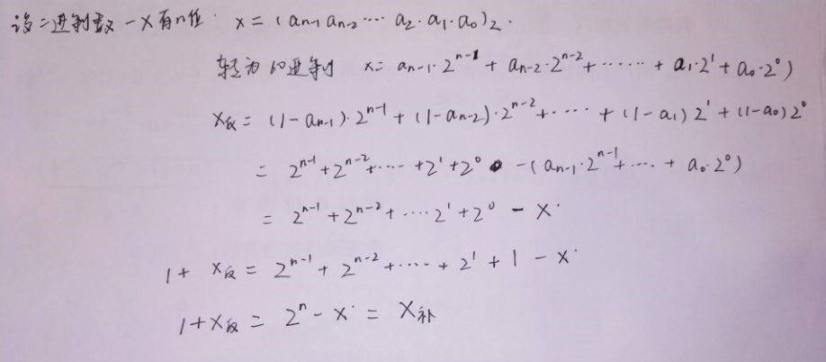

# part of 1

Write out variables  x, y and z in binary code 

1) int8_t x = 67;  int8_t y = -7;   int8_t z = y - x;

    x=(01000011)2  
    y=(11111001)2    
    z=(10110110)2
2) int8_t x = 0xd3; 
    
    x=(11010011)2  overflow

3) uint8_t = 0xd3; 
    
    x=(11010011)2

4) int8_t x = 127;  int8_t y = -7;   int8_t z = y – x;

    x=(01111111)2

    y=(11111001)2

    z=(01111010)2

    z:overflow
5) float x = 1.125; 

    x=(1.001)2

6) float x = 23.0; 

    x=(10111)2
7) float x = 0.45;

    x=(0.0111001100……)2
    有精度损失

  part of 2
  
    1)Method of complements：In mathematics and computing, the method of complements is a technique used to subtract one number from another using only addition of positive numbers.补码法：在数学和计算中，补码法是一种仅使用正数来从一个数减去另一个数的技术。
    
    2)Byte ：The byte is a unit of digital information that most commonly consists of eight bits, representing a binary number.字节：字节是数字信息的一个单元，通常由八位组成，表示二进制数。
    
    3)Integer (computer science) ：In computer science, an integer is a datum of integral data type, a data type that represents some range of mathematical integers.
    整数（计算机科学）：在计算机科学中，整数是整数数据类型的数据，是表示某种数学整数范围的数据类型。
    4)Floating point：In computing, floating-point arithmetic (FP) is arithmetic using formulaic representation of real numbers as an approximation so as to support a trade-off between range and precision.
    浮点：在计算中,浮点算法是使用实数公式作近似，在范围和精度之间权衡的算法。

   1)请证明：二进制的负数（two‘s complement of X）等于 X 的 ones’ complement  ＋ 1（即，X每位求反加1） 
   
   
   
   2)Int8_t x = - 017; 请用8进制描述变量 x。在c中017即(017)8

   x=-017=(-15)10=(11110001)2=(361)8

   1)C程序：int8_t  x = -0x1f;  int y = x;  请用16进制描述变量 x 和 y，并说明 int y = x 的计算过程。 

   x=-0x1f=(-31)10=(11100001)2
   when y=x，sign extended.
   y=（1111 1111 1111 1111 1111 1111 1110 0001）2=0xffffffe1
   
   2)请用数学证明，为什么可以这么计算。

   当其符号位向左扩展时，该补码的反码并没有改变数值大小，而该负数的绝对值大小即为补码的反码加一，因而他的绝对值大小没有变，而符号位保留，因此可以这么计算。

   1)   NaN 是什么？

   NaN ——Not a number，该值作为一些无效操作的结果返回.一般来说，涉及NaN的操作的操作都会导致NaN,由标准指定的NaN的表示具有一些未指定的位，可用于对错误类型或源进行编码；但是没有用于该编码的标准。NaN有默认的静态还有可选的信令.运行时系统可以使用信令NaN来标记未初始化的变量，或者用其他特殊值扩展浮点数，而不会减慢使用普通值的计算，但是这种扩展并不常见。 

