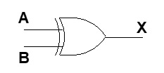

1) NOT

    A is the input and X is the output.

    Boolean expression：X = （A）’
    
    logical diagram： 

    turth table:

    | A     | x   | 
    | ----- | --: |  
    | 0     |  1  |   
    | 1     |  0  |   

    My word:
    
     If input 0 ,NOT output 1.
     
     If input 1.NOT output 0.
2) XOR
    A B is imput and X is output.

    Boolean expression: X  = A⊕B

    logical diagram： 

    Truth table:
    
    | A   | B   |  X  |
    | -- | -----:   | :----: |
    | 0   | 0     |   0    |
    | 0   | 1      |   1    |
    | 1    | 0    |   1    |
   | 1 | 1   |   0   |

    My word:

    If input A and B is same, XOR output 0.

    If input A and B is different,XOR output 1.

 3) (B+C).jpg)

 4)  | A   | B  |A'|AB  |  X  |
        | --|--|-- | --: | :----: |
        | 0   | 0  |1|0   | 1    |
     | 0   | 1  |1 |0   | 1    |
      | 1    | 0  |0|0  |   0   |
     | 1 | 1   | 0|1|  1  |

5)
    Circuit equivalence is when the input is same,the output is same.

    |A|B|(AB)'|A'+B'|
    |-|-|----:|:---:|
    |0|0|1|1|
    |0|1|1|1|
    |1|0|1|1|
    |1|1|0|0|

6)
 

7) 

    (1) (X8 X7 X6 X5 X4 X3 X2 X1)2 or (00001111)2 = ( X8 X7 X6 X5 1111 )2

    (2) (X8 X7 X6 X5 X4 X3 X2 X1)2xor (00001111)2 = (如果x与对应位的数字一样，那么这位是0，否则为1) )2

    (3) ((X8X7X6X5X4X3X2X1)2 and (11110000)2 ) or (not (X8X7X6X5X4X3X2X1)2 and (00001111)2) = (X8 X7 X6 X5 NX4 NX3 NX2 NX1)2

