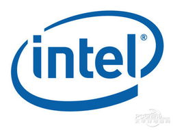
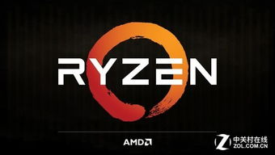
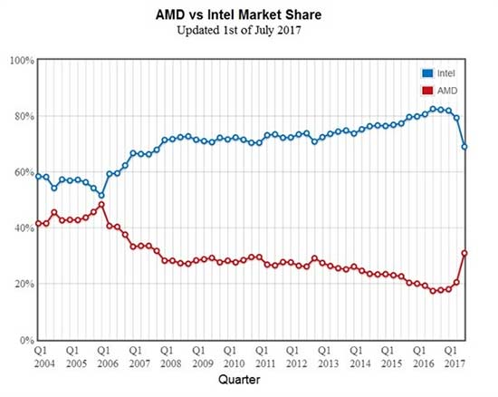

#  英特尔背后的70-20-10定律
首先，让我们来介绍一下70-20-10律，在信息科技领域发展成熟后，一般在全球容不下三个以上的主要竞争者。而其中一定有一个老大，占百分之六七十的市场比率，而老二（和老三）则占据百分之二三十的市场，剩下的就由其他小公司分配。
    
而英特尔公司是世界上最大的半导体公司，也是第一家推出x86架构处理器的公司，总部位于美国加利福尼亚州圣克拉拉。由罗伯特·诺伊斯、高登·摩尔、安迪·葛洛夫，以“集成电子”之名在1968年7月18日共同创办公司，将高级芯片设计能力与领导业界的制造能力结合在一起。1971年，英特尔推出了全球第一个微处理器,微处理器所带来的计算机和互联网革命，改变了整个世界。英特尔也有开发主板芯片组、网卡、闪存、绘图芯片、嵌入式处理器，与对通信与运算相关的产品等。
    

在十几年前，半导体市场上存在着两个旗鼓相当的竞争者，一个则是英特尔，一个则是AMD。但是在近几年，英特尔逐渐形成对半导体市场垄断的局面。AMD的市场份额一度跌下两成。因为英特尔的雄厚资金，把AMD打的死死的。并且，凭借着技术上的优势，英特尔的每代处理器所提升的性能十分少，似乎与CPU市场上已经不适用于摩尔定律。而英特尔也被广大网友们戏称为牙膏厂（每次提升都像挤牙膏一样）。整个市场出现被英特尔垄断的趋势，而这个局面刚好与70-20-10所接近。

信息产品的生态链各环节之间的耦合性非常强。英特尔所用的架构被普遍支持，而AMD的性能和兼容性使得他的市场份额越来越低。英特尔与微软所形成的联盟似乎越来越牢不可破。特别是游戏对英特尔的支持，使得英特尔越来越多被选择。AMD的生存空间被压榨，其他厂商甚至根本没有生存空间。

AMD真的永无翻身之日了吗？答案当然不是的。AMD在2016年推出了Zen架构，吸引了许多电脑组装者的眼球。而在去年，成功推出了Ryzen系列PC处理器，性能大幅提升。

因此AMD的市场份额实现飙升。而在服务器市场也在不断地创新高。AMD凭借着其出色的性能和超高的性价比夺得了市场。英特尔此时正面临着保市场还是保利润的抉择。

事实证明，70-20-10定律似乎牢不可破，但是一旦企业创新成功，就可能让整个市场重新洗牌。

Intel和AMD缠斗数十年，而前者一直占据上风，如今风向转变，AMD迎来了难得的历史机遇，最终AMD会否能如愿进一步提升市场份额还要时间来验证。事实上，Intel已认识到了这一危机，并挖来了为AMD研发Zen架构作出了重大贡献的Jim keller等多个人才，只是Intel需要与时间进行竞赛，尽快扭转当前不利的局面。英特尔的垄断是否会被打破，半导体市场的70-20-10是否会被重新洗牌，让我们拭目以待吧。

