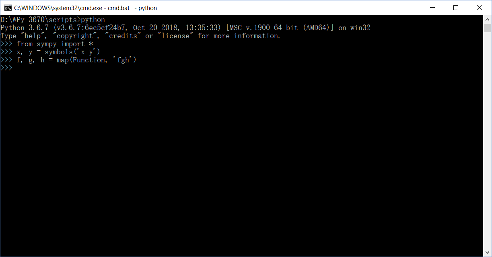
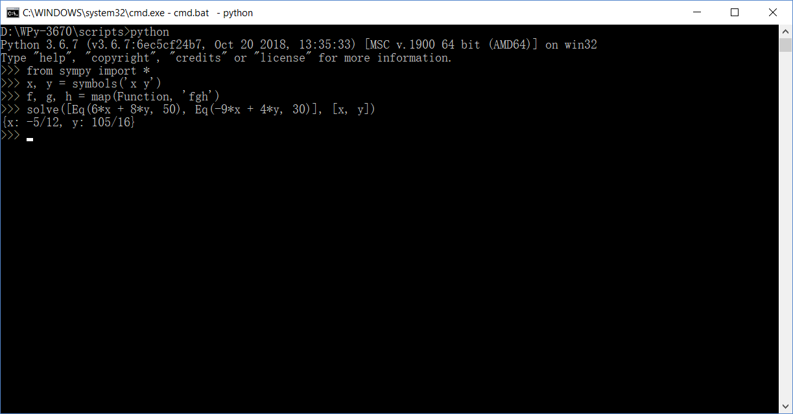
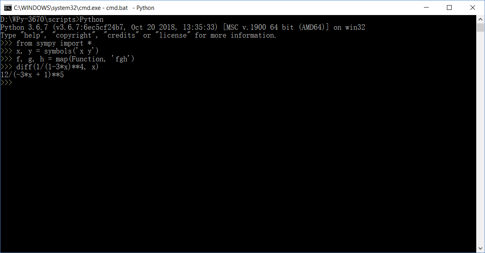
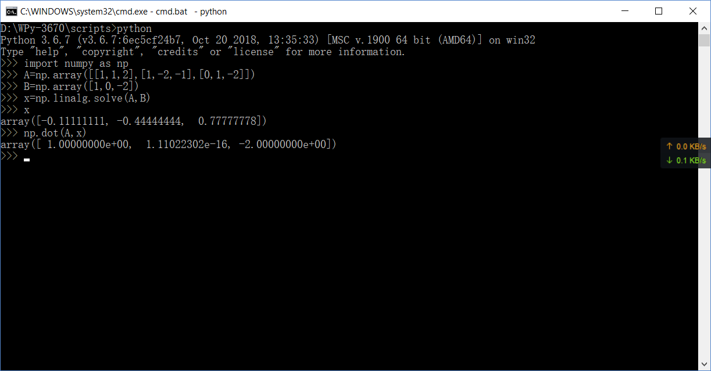
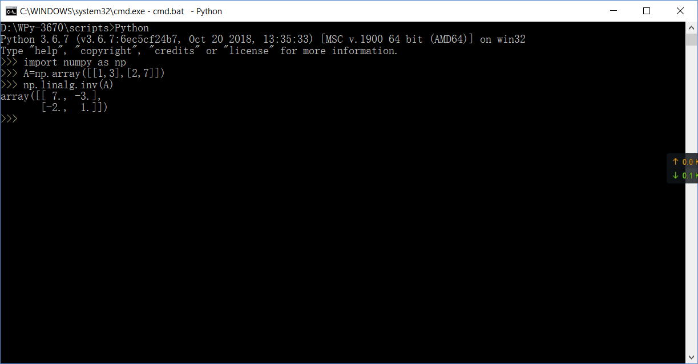

# python 编程实验报告
## 使用Python求解高等数学作业

首先，使用sympy前，要使用下面的操作，导入sympy库，并将各种数学符号定义
     >>> from sympy import *
     >>> x, y = symbols('x y')
     >>> f, g, h = map(Function, 'fgh')

### 1.求解一个二元一次方程组

    这里我们随手输入一个方程组作为试验
    6x + 8y = 50
    -9x + 4y = 30
    标准答案是x: -5/12, y: 105/16
    
    然后输入 solve([Eq(6*x + 8*y, 50), Eq(-9*x + 4*y, 30)], [x, y])

结果与标准答案完全相同，是正确的！

这就是二元一次方程组的解法

指令是solve([Eq(a*x + b*y，c), Eq(c*x + d*y, e)], [x, y])

### 2。求解一个不定积分

例如

这时候输入代码>>>integrate(1/sqrt(4-x**2), (x, 0, 1))

sqrt表示根号，**表示幂

结果如下

与计算结果完全相同

这就是求不定积分的解法

指令是integrate(被积函数), (积分变量, 积分下限, 积分上限))

### 求解导数

例如

这时候输入代码>>>diff(1/(1-3*x)**4, x)

结果正确

## 使用Python求解线性代数作业

首先要导入线性代数的numpy库

    >>>import numpy as np

### 求解并求dot验证

代码如下
    
    求解
    >>>A=np.array([[1,1,2],[1,-2,-1],[0,1,-2]])
    >>>B=np.array([1,0,-2])
    >>>x=np.linalg.solve(A,B)
    >>>x
    对话框输出答案

    求dot
    >>>np.dot(A,x)
    对话框输出答案

可见在误差允许的范围内，结果是正确的

### 矩阵求逆

这是手算的做法

现在我们用Python计算
代码如下

    >>>A=np.array([[1,3],[2,7]])
    >>>np.linalg.inv(A)

#这就完成了用Python完成高数的解方程组，求定积分，求导和线性代数的求解和求逆了