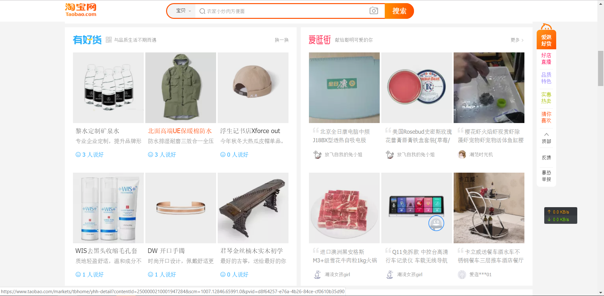
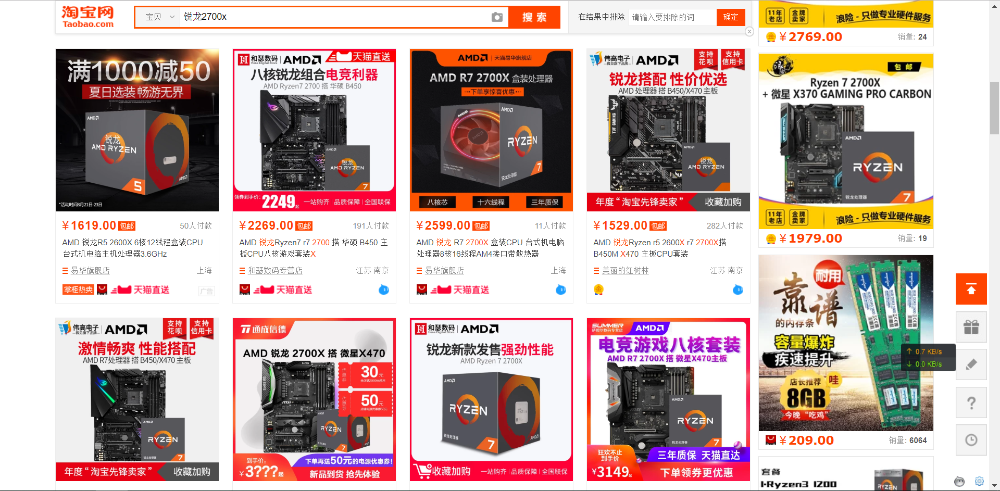
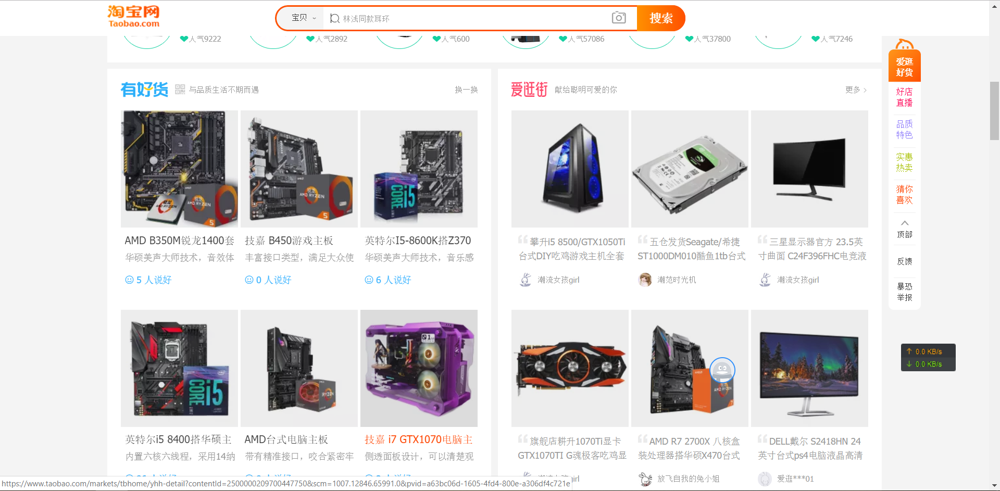
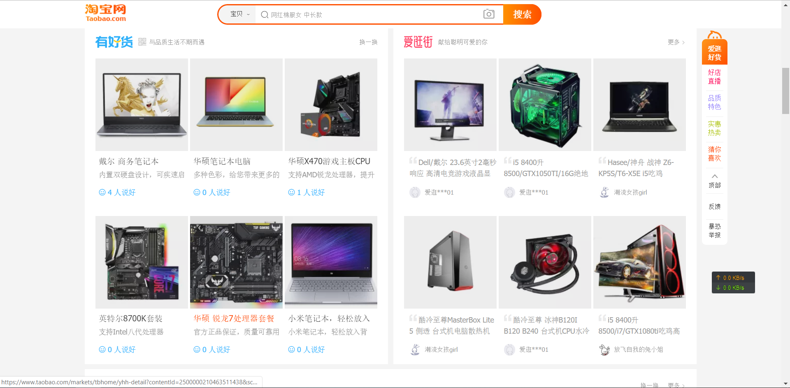
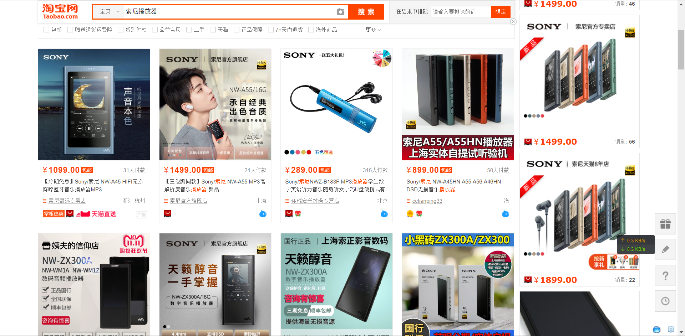
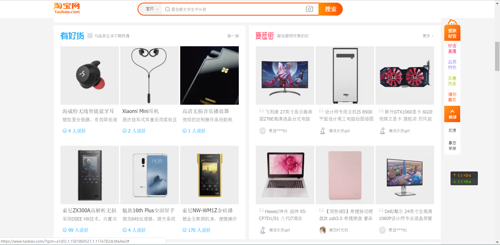
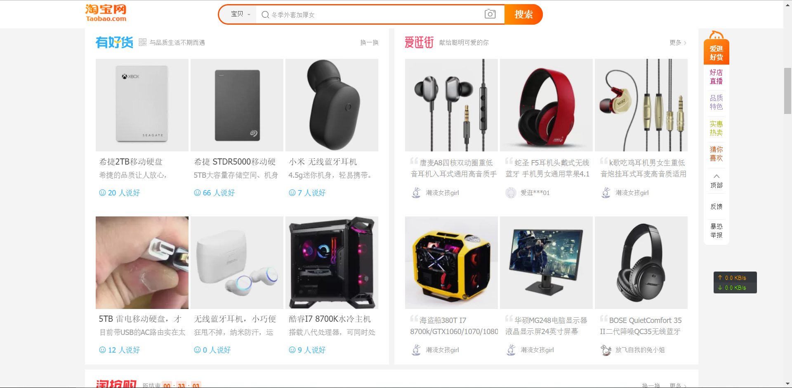
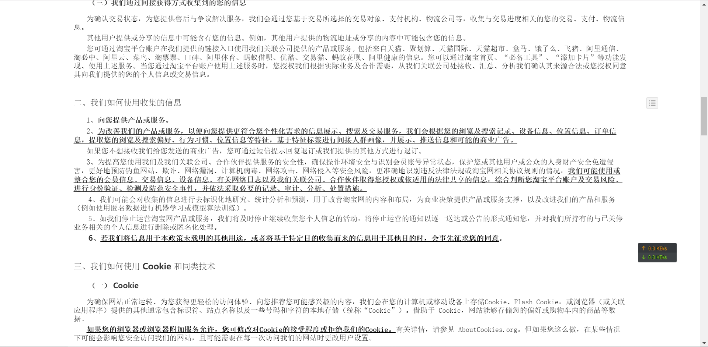

# 淘宝网的伦理风险行为收集
如今，电子商务蓬勃发展，而电子商务的代表————淘宝，已经几乎渗透到了每一个现代人的生活。但是，在大数据时代的我们，数据的收集要面临着许多伦理问题，这里，作者以淘宝网作为例子，收集了一些运用大数据技术的风险行为。

## 运用大数据搜集用户习惯和隐私
首先，新开通一个淘宝账户，用此账户使用淘宝，在淘宝页面的有好货和爱逛街界面，应该是这样子的

这时的推荐是无规律的，包括食物，美妆，音乐，家居，服饰，智能设备等类型。

### 这时作者在搜索框内搜索AMD的旗舰CPU锐龙2700x
并且将页面前八个通通点击一次进入商品详情页面。
#### 之后，作者分次在搜索框内输入“主板”、“显卡”、“内存条”、“电脑电源”、“笔记本电脑“五个关键字，并且每次进入后都将页面前四个通通点击一次进入商品详情页面。
### 这时候我们刷新再来看同一页面

发现他所推荐的已经是DIY电脑的配件了，和我上面输入的大致属于相同类型。

（并且还给我推荐了个硬盘？）
上述事实已经充分说明了淘宝网的确搜集了用户数据。

### 作者再次进行试验
分次在搜索框内输入“索尼播放器”，“ZX300”、“蓝牙耳机”、“森海塞尔”（耳机知名品牌）、“索尼耳机”、“降噪耳机”、“BOSE”(耳机知名品牌)。并且分别点击每个页面的前八个商品。这时刷新页面，“有好货爱购物”页面已经发生了细微变化，该页面“有好货”已经出现了播放器和耳机（还乱入了个手机？），“爱购物”类型变化仍不明显。

#### 作者继续疯狂搜索耳机

这时候“有好货爱购物”页面已经完全变化了，给我推荐了一大堆耳机。（虽然不是我想要的）

上述事例充分说明了淘宝网会搜集用户搜索数据。
接下来作者在注册页面找到了法律声明和隐私权政策。

## 可是对于大部分用户来说，他们会看这一堆对于他们无聊的法律条文吗？
他们不会注意这些冗长的条文，条文中有许多“可能”这些不明确字眼，用户的信息被搜集了会用于干什么？绝大多数的用户不清楚。而万一这些存有大量数据的服务器被攻击，泄露的数据会对用户有什么影响，这些都是未知的。

在绝大多数用户未知的情况下，并且网站方未明示的情况下，淘宝网等网站收集用户偏好，这也许已经涉及了道德与伦理的问题，是否应该有法律规范，这值得所有人的思考。