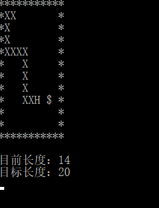

# 字符版本的贪吃蛇游戏设计和智能蛇的简单算法

本次博客的环境是Ubuntu18.04
## 贪吃蛇的游戏设计
本次贪吃蛇的设计方法是自顶向下的方法

### 首先，做好一些必备的工作
#### 用矩阵表示蛇
因此定义一个矩阵来表示蛇
    
    char map[12][12] =
    { "***********",
    "*XXXXH    *",
    "*         *",
    "*         *",
    "*         *",
    "*         *",
    "*         *",
    "*         *",
    "*         *",
    "*         *",
    "*         *",
    "***********" };

#### 做好一些基本的定义
    
    #define SNAKE_MAX_LENGTH 20
    #define SNAKE_HEAD 'H'
    #define SNAKE_BODY 'X'
    #define BLANK_CELL ' '
    #define WALL_CELL '*'
    #define SNAKE_FOOD '$'
    int snakeX[SNAKE_MAX_LENGTH] = { 1,2,3,4,5 };
    int snakeY[SNAKE_MAX_LENGTH] = { 1,1,1,1,1 };
    int moneyX, moneyY;
    int snakeLength = 5;
    int continuegame = 1;

### 然后，将程序的主体框架想出来
用伪代码表示

    输出字符矩阵
    投放食物
	WHILE not 游戏结束 DO
		ch＝等待输入
		CASE ch DO
		‘A’:左前进一步，break 
		‘D’:右前进一步，break    
		‘W’:上前进一步，breashangshuk    
		‘S’:下前进一步，break    
		END CASE
        判断是否吃食物
            如果是，吃食物并重新投放食物，后继续循环
            否则继续循环
		输出字符矩阵
	END WHILE
	输出 Game Over!!! 

### 遵循自顶向下的思路，把上述框架的每一步用函数形式分开写出来

    编写
    1、输出矩阵函数
    2、判断游戏是否结束函数
    3、移动函数
    4、吃食物函数
    5、投放食物函数

这样整个游戏的设计就基本完成了。

其中通过学习，清屏既可以用过系统指令system("clear");实现

也可以通过VT100终端标准输出esc序列实现， printf("\033[2J") 就实现了清屏。（经过亲身试验）

上一版本中每输入一次都要敲一次回车感到很不方便

这次通过[Linux下非阻塞地检测键盘输入的方法 (整理)](http://bbs.chinaunix.net/thread-935410-1-1.html)学习到了如何在Linux下实现微软下的kbhit()和getch()函数。将上一版本的贪吃蛇融入到这里，就可以不用每输入一次敲一次回车了。

将上述工作一起实现的贪吃蛇的源代码[Linux下的贪吃蛇.c](snake/kbhit.c) 

## 智能蛇的简单算法

在智能蛇中，玩家只需要坐着看蛇自己吃就可以了,因此用于输入的模块可以完全舍弃。
### 程序主体结构如下       
    
    输出字符矩阵
    投放食物
	WHILE not 游戏结束 DO
		ch＝智能蛇算法
		CASE ch DO
		‘A’:左前进一步，break 
		‘D’:右前进一步，break    
		‘W’:上前进一步，breashangshuk    
		‘S’:下前进一步，break    
		END CASE
            判断是否吃食物
                如果是，吃食物并重新投放食物，后继续循环
                否则继续循环
		输出字符矩阵
        wait(time)
	END WHILE
	输出 Game Over!!! 

### 智能蛇算法的伪代码
    // Hx,Hy: 头的位置
    // Fx,Fy：食物的位置
	function whereGoNext(Hx,Hy,Fx,Fy) {
	    // 用数组distance[3]={0,0,0,0} 记录向各个方向走后离食物的距离
	    // 选择距离最小的并且该方向只能满足是空白或者是食物的
	    // 返回 上述选择方向所代表的wsad
	    }

将上述工作一起实现的智能蛇的源代码[Linux下的智能蛇.c](snake/智能蛇.c)

