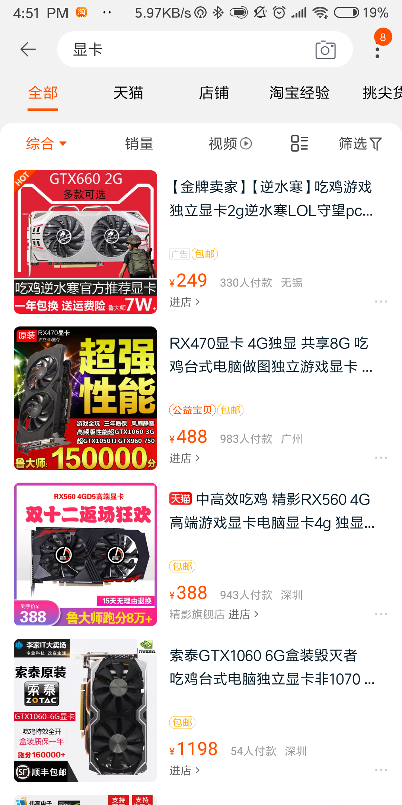

# 互联网时代的盈利模式

互联网的盈利模式有上述几种及其分支。但是究其核心，是互联网的流量。吴军博士在浪潮之巅中，用了“流量、流量、流量”来强调新经济时代的核心。因此，本文就围绕“流量”这个核心，介绍互联网时代的集中突出的盈利模式。

## 流量的鼻祖——雅虎

在雅虎出现之前已经存在了十年，然而在雅虎之前，互联网对于普通百姓来说是奢侈品，互联网公司也没有找到正确的商业模式能够持续使互联网有活力并且盈利。而杨致远和菲洛创建了门户网站——雅虎。他们的商业模式简直不能够太简单，就是把纸质报纸的商业模式搬过来，通过广告来获得收入，从而为用户提供免费服务。

在全是收费的互联网市场突然杀出一个免费的雅虎，就如同在菜市场有人免费送猪肉一样，雅虎的流量不断呈几何级数增长，而流量的激增充分带动了雅虎广告的收入，也让越来越多的风险投资入资雅虎，雅虎一下子就成为了互联网的第一品牌。

因为雅虎模式的成功，无数互联网公司纷纷效仿，到后来许多公司错误地认识流量，疯狂追求流量，提高流量从手段变成目的，导致许多问题。当然这是题外话，但由此看来，互联网流量确实是相当重要的，而雅虎在这个盈利模式中做出了突出的贡献。

## 互联网入口中心的转变——从门户网站到搜索引擎
在搜索引擎中，全球第一大搜索引擎是Google，而最为中国人熟悉的是百度。由于某些原因，Google并没有打入全球最大的市场之一——中国，但是基于他的成功性，在这里一并介绍Google与百度。

Google现在依托许多部门进行盈利，但是其毕竟是由搜索引擎起家，百度也是如此，因此，在这里着重介绍他们的搜索引擎有关的盈利模式。

在Yahoo之后，每个互联网公司都充分注重流量的作用，Google和百度也不例外。我仍记得，十年前我打开浏览器显示的是hao123.com门户网站，而如今，我打开浏览器显示的是Google和百度的搜索引擎。我想，这不仅是我一个人的转变，这是许多人共同的转变。因此，搜索引擎的流量就显得尤为重要了。国内许多公司当然意识到这个问题，然而搜狗、360搜索等都相继败下阵来，此时百度在国内一家独大。

我在此处着重介绍Google和百度的异同

### 同
Google和百度两家公司都是以广告收入为绝大多数收入
### 异
#### 百度主要以两种方式盈利
##### ①、关键字竞价

　　百度的搜索竞价排名。百度竞价排名是百度在国内首创的一种按效果付费的网络推广方式，按照访问数量计费，简单说就是，对搜索关键字出价，出价越高，按此关键字搜索的结果中排名就可能越靠前，点击的人数就可能越多，广告效果也就越好，所要付出的费用也就越多。广告效果体现在了搜索结果之中
##### ②、百度火爆地带

　　百度火爆地带是一种针对特定关键词的网络推广方式，按时间段（如一年）固定付费，出现在百度网页搜索结果第一页的右侧，不同位置价格不同。企业购买了火爆地带关键词后，就会被主动查找这些关键词的用户找到，给企业带来更多的商业机会。

#### Google采取的是单一的盈利模式

　　目前其99%的收入都来自广告。Google主要的广告模式叫Google Adwords（Google关键词广告），是将关键词卖给出价最高的广告主，然后广告按出价排序出现在搜索结果右侧，且只有被网友点选到的才需计费，这与百度的竞价相似，但要强调一点不同之处，Google的广告和搜索结果是分开的，左侧搜索结果仍按访问量、用户喜爱度、外部连接等专业标准来排名，广告效果只体现在右侧。

这两家公司依托其超大的流量，在广告上可谓是赚的盆满钵满。但是百度的竞价模式，特别是某些医疗竞价，在莆田系医院、魏则西时间后可谓是饱受诟病。当然这是题外话了，但是流量带来的盈利是无可置疑的。正因如此，吴军博士才多次强调流量在新经济时代下的作用。

## 电商巨头——阿里巴巴的淘宝
阿里巴巴的盈利模式可谓是多种多样，而卖流量当然也是其一个重要的盈利方法。淘宝当然在阿里巴巴中占据一个相当大的份额。淘宝的本质其实与谷歌和百度的搜索引擎没有太大区别，流量对于淘宝来说也是十分重要的。

### 淘宝盈利模式之一——广告
是的，又是广告，流量与广告息息相关，可以说有流量就有人投广告，就有钱赚。因此，淘宝的搜索引擎当然也不会放过广告，淘宝和百度其实没差别，都是通过竞价排名来赚钱。

如图，第一个便是广告了

### 淘宝盈利模式之二——大商城
淘宝除了是个搜索引擎外，同时也是个大商城，所以赚钱模式和传统的线下商场也没太大区别，也就是收取入场费。阿里对天猫每家入驻的天猫店都收取保证金，按类目的不同金额有所差异，据不完全统计，整个天猫有大约50万的商家，那总的这笔保证金绝对不是小数。

不过，保证对天猫店铺来说不是大头，更大的服务费，这块分为两部分，一部分是年费，一次性缴付，分3万和6万两个档次，如果每年销售额达标，这部分费用可以返还一半或者是全额。另一部分就是5%的扣点，每销售一件就从销售额中提取，这也是非常胖达的一部分，双11天猫成交额2000亿，那光靠这个扣点就能收取100亿了。2017年天猫总的交易流水达2.1万亿，按5%的扣点算就是整整1050亿的收入。

淘宝依托其电商平台巨大的流量收取商家服务费，实现了巨额盈利。由此可见，流量对于互联网的盈利有多重要！

还有许多例子，例如在视频播放上各大视频网站都会有较长的广告时间，而如果想跳过广告就不得不充值开通会员，因此无论看不看广告，他们都是赚钱。许多软件打开页面便会跳出广告。而这根本的是其拥有足够的用户流量，在这里就不详细叙述了。流量的重要性又再一次凸显出来。

总结：在这信息化的时代中，各大IT巨头都是依托充足的流量进行广告或者收取服务费又或是其他手段进行盈利。这也是为何如此多公司对流量如此狂热的原因。因为在某些程度上，流量便是金钱。这也是为何吴军博士在浪潮之巅中，用了“流量、流量、流量”来强调新经济时代的核心！

